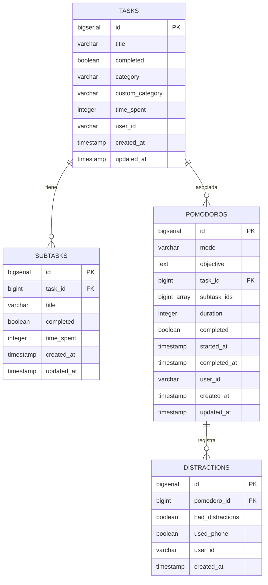
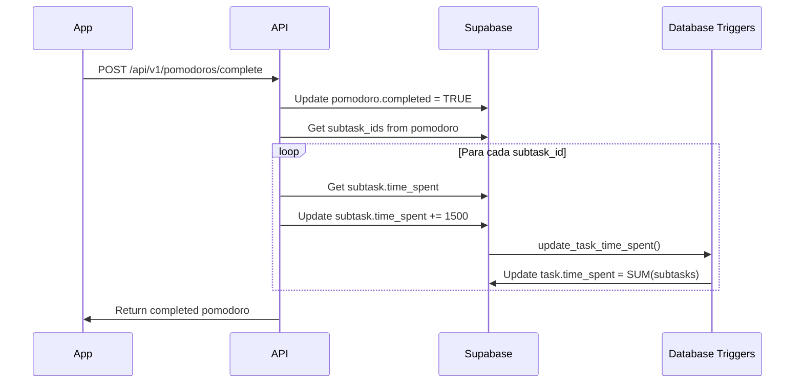
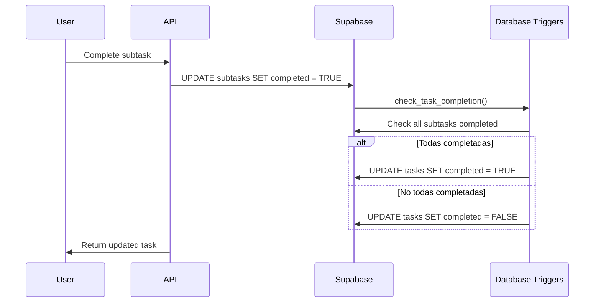

# Esquema de Base de Datos - MyPomodoro

Este documento describe el esquema completo de la base de datos para la aplicación MyPomodoro.

## 📊 Diagrama ER (Entity Relationship)



## 🗂️ Estructura de Tablas

### Tabla: `tasks`

Tabla principal que almacena las tareas del usuario.

| Columna | Tipo | Restricciones | Descripción |
|---------|------|---------------|-------------|
| `id` | BIGSERIAL | PRIMARY KEY | Identificador único auto-incremental |
| `title` | VARCHAR(500) | NOT NULL | Título de la tarea |
| `completed` | BOOLEAN | NOT NULL, DEFAULT FALSE | Estado de completitud |
| `category` | VARCHAR(20) | NOT NULL, DEFAULT 'personal', CHECK | Categoría: 'personal', 'laboral', 'otro' |
| `custom_category` | VARCHAR(100) | NULL | Nombre personalizado si category = 'otro' |
| `time_spent` | INTEGER | NOT NULL, DEFAULT 0 | Tiempo total gastado en segundos (suma de subtareas) |
| `user_id` | VARCHAR(255) | NULL | ID del usuario (para multi-usuario) |
| `created_at` | TIMESTAMP WITH TIME ZONE | NOT NULL, DEFAULT NOW() | Fecha de creación |
| `updated_at` | TIMESTAMP WITH TIME ZONE | NOT NULL, DEFAULT NOW() | Fecha de última actualización |

**Índices:**
- `idx_tasks_user_id` en `user_id`
- `idx_tasks_category` en `category`
- `idx_tasks_completed` en `completed`
- `idx_tasks_created_at` en `created_at` (DESC)

**Relaciones:**
- Una tarea puede tener múltiples subtareas (1:N)
- Una tarea puede estar asociada a múltiples pomodoros (1:N)

---

### Tabla: `subtasks`

Almacena las subtareas asociadas a cada tarea.

| Columna | Tipo | Restricciones | Descripción |
|---------|------|---------------|-------------|
| `id` | BIGSERIAL | PRIMARY KEY | Identificador único auto-incremental |
| `task_id` | BIGINT | NOT NULL, FOREIGN KEY (tasks.id) ON DELETE CASCADE | ID de la tarea padre |
| `title` | VARCHAR(500) | NOT NULL | Título de la subtarea |
| `completed` | BOOLEAN | NOT NULL, DEFAULT FALSE | Estado de completitud |
| `time_spent` | INTEGER | NOT NULL, DEFAULT 0 | Tiempo gastado en esta subtarea en segundos |
| `created_at` | TIMESTAMP WITH TIME ZONE | NOT NULL, DEFAULT NOW() | Fecha de creación |
| `updated_at` | TIMESTAMP WITH TIME ZONE | NOT NULL, DEFAULT NOW() | Fecha de última actualización |

**Índices:**
- `idx_subtasks_task_id` en `task_id`
- `idx_subtasks_completed` en `completed`

**Relaciones:**
- Cada subtarea pertenece a una tarea (N:1)
- Se elimina automáticamente si se elimina la tarea (CASCADE)

---

### Tabla: `pomodoros`

Registro de sesiones de pomodoro completadas o en progreso.

| Columna | Tipo | Restricciones | Descripción |
|---------|------|---------------|-------------|
| `id` | BIGSERIAL | PRIMARY KEY | Identificador único auto-incremental |
| `mode` | VARCHAR(20) | NOT NULL, DEFAULT 'pomodoro', CHECK | Modo: 'pomodoro', 'shortBreak', 'longBreak' |
| `objective` | TEXT | NULL | Objetivo del pomodoro |
| `task_id` | BIGINT | FOREIGN KEY (tasks.id) ON DELETE SET NULL | ID de la tarea asociada |
| `subtask_ids` | BIGINT[] | NULL | Array de IDs de subtareas asociadas |
| `duration` | INTEGER | NOT NULL, DEFAULT 1500 | Duración del pomodoro en segundos (25 min por defecto) |
| `completed` | BOOLEAN | NOT NULL, DEFAULT FALSE | Estado de completitud |
| `started_at` | TIMESTAMP WITH TIME ZONE | NULL | Fecha y hora de inicio |
| `completed_at` | TIMESTAMP WITH TIME ZONE | NULL | Fecha y hora de completado |
| `user_id` | VARCHAR(255) | NULL | ID del usuario |
| `created_at` | TIMESTAMP WITH TIME ZONE | NOT NULL, DEFAULT NOW() | Fecha de creación |
| `updated_at` | TIMESTAMP WITH TIME ZONE | NOT NULL, DEFAULT NOW() | Fecha de última actualización |

**Índices:**
- `idx_pomodoros_user_id` en `user_id`
- `idx_pomodoros_completed` en `completed`
- `idx_pomodoros_mode` en `mode`
- `idx_pomodoros_task_id` en `task_id`
- `idx_pomodoros_created_at` en `created_at` (DESC)

**Relaciones:**
- Puede estar asociado a una tarea (N:1, SET NULL si se elimina la tarea)
- Puede tener múltiples registros de distracciones (1:N)

**Valores por defecto de duración:**
- `pomodoro`: 1500 segundos (25 minutos)
- `shortBreak`: 300 segundos (5 minutos)
- `longBreak`: 900 segundos (15 minutos)

---

### Tabla: `distractions`

Registro de distracciones reportadas durante pomodoros.

| Columna | Tipo | Restricciones | Descripción |
|---------|------|---------------|-------------|
| `id` | BIGSERIAL | PRIMARY KEY | Identificador único auto-incremental |
| `pomodoro_id` | BIGINT | NOT NULL, FOREIGN KEY (pomodoros.id) ON DELETE CASCADE | ID del pomodoro asociado |
| `had_distractions` | BOOLEAN | NOT NULL | Si hubo distracciones en el pomodoro |
| `used_phone` | BOOLEAN | NOT NULL | Si se usó el celular durante el pomodoro |
| `user_id` | VARCHAR(255) | NULL | ID del usuario |
| `created_at` | TIMESTAMP WITH TIME ZONE | NOT NULL, DEFAULT NOW() | Fecha de creación |

**Índices:**
- `idx_distractions_pomodoro_id` en `pomodoro_id`
- `idx_distractions_user_id` en `user_id`

**Relaciones:**
- Cada distracción pertenece a un pomodoro (N:1)
- Se elimina automáticamente si se elimina el pomodoro (CASCADE)

---

## ⚙️ Funciones y Triggers

### Función: `update_updated_at_column()`

Actualiza automáticamente el campo `updated_at` cuando se modifica un registro.

**Aplicada en:**
- `tasks`
- `subtasks`
- `pomodoros`

### Función: `update_task_time_spent()`

Actualiza automáticamente el campo `time_spent` de la tarea cuando cambia el `time_spent` de una subtarea.

**Trigger:** `update_task_time_on_subtask_time_change`
- Se ejecuta después de INSERT, UPDATE (time_spent) o DELETE en `subtasks`
- Calcula la suma de todos los `time_spent` de las subtareas y actualiza la tarea

### Función: `check_task_completion()`

Marca automáticamente una tarea como completada si todas sus subtareas están completadas.

**Trigger:** `check_task_completion_on_subtask_change`
- Se ejecuta después de INSERT, UPDATE (completed) o DELETE en `subtasks`
- Verifica si todas las subtareas están completadas y actualiza el estado de la tarea

---

## 🔄 Flujo de Datos

### Ejemplo: Completar un Pomodoro



### Ejemplo: Actualización Automática de Tareas



---

## 📝 Notas de Implementación

### Tipos de Datos

- **Tiempo**: Todos los tiempos se almacenan en **segundos** (INTEGER)
- **IDs**: Se usan BIGSERIAL para soportar grandes volúmenes de datos
- **Arrays**: `subtask_ids` usa el tipo `BIGINT[]` de PostgreSQL
- **Timestamps**: Todos usan `TIMESTAMP WITH TIME ZONE` para manejar zonas horarias

### Constraints y Validaciones

- **CHECK constraints** en `category` y `mode` para validar valores permitidos
- **Foreign Keys** con CASCADE o SET NULL según el caso:
  - Subtareas: CASCADE (se eliminan con la tarea)
  - Pomodoros: SET NULL (mantienen el registro aunque se elimine la tarea)
  - Distracciones: CASCADE (se eliminan con el pomodoro)

### Multi-usuario

El esquema está preparado para multi-usuario mediante el campo `user_id` en todas las tablas principales. Para una implementación completa con Supabase Auth, se puede:

1. Usar `auth.users.id` como `user_id`
2. Agregar RLS (Row Level Security) policies
3. Convertir `user_id` a UUID

### Optimizaciones

- **Índices** en campos frecuentemente consultados (user_id, category, completed, dates)
- **Índices compuestos** pueden agregarse según patrones de consulta
- **Triggers** mantienen consistencia sin necesidad de lógica en la aplicación

---

## 🚀 Scripts de Migración

Para levantar la base de datos desde cero, ejecuta el script SQL completo:

```bash
# En Supabase SQL Editor
# Ejecutar: docs/database/schema.sql
```

O desde la línea de comandos con psql:

```bash
psql -h tu-host.supabase.co -U postgres -d postgres -f docs/database/schema.sql
```

---

*Última actualización: Esquema inicial de MyPomodoro*
